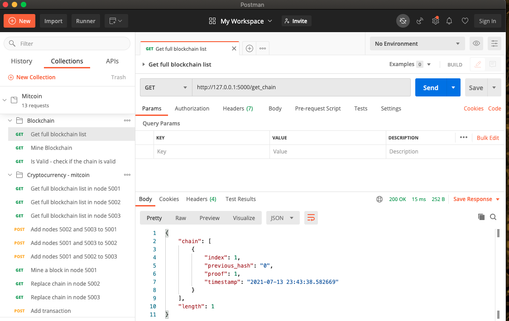

# mitcoin
Simple Blockchain and Cryptocurrency implementation with Proof of Work consensus

## To run the blockchain
- Run the `Blockchain/blockchain.py` file
- Import the Postman Collection from `postman/` folder and interact with the blockchain using the endpoints in 'Blockchain' folder of the collection

## To run the cryptocurrency
- Run the `mitcoin_node_5001.py`, `mitcoin_node_5002.py` and `mitcoin_node_5003.py` files from `cryptocurrency/` folder
- Interact with the cryptocurrency using the endpoints in the `Cryptocurrency - mitcoin` folder of the postman collection

## Postman Collection
